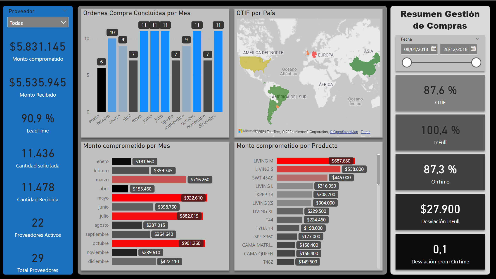
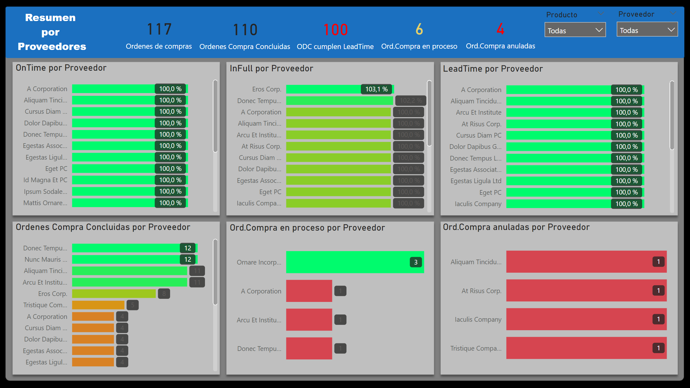
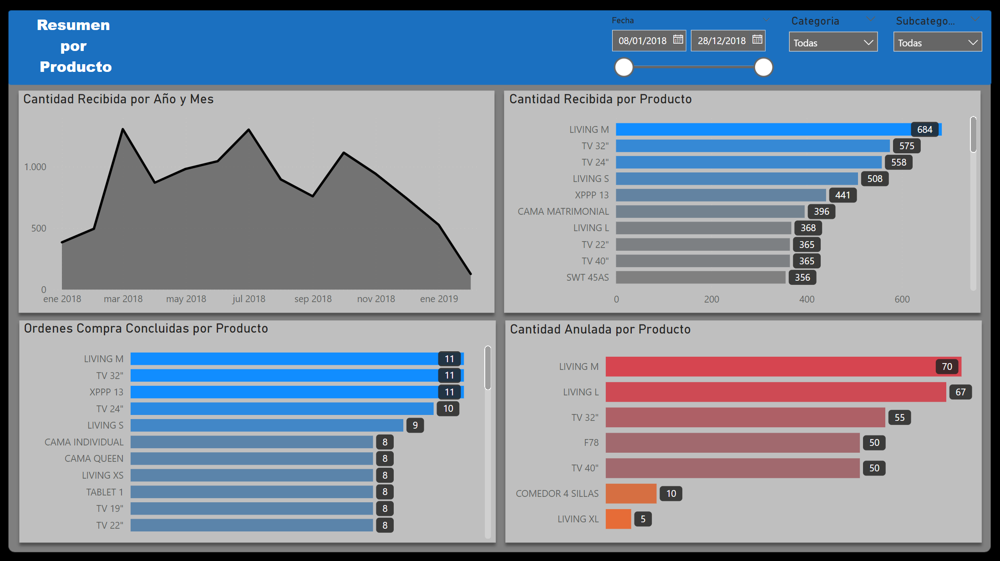

# Reporte Supply Chain Analytics

## Explicación

Informe en el que se presenta un resultado global de la gestión de Supply Chain de una empresa ficticia. Se trata de un modelo de Business Intelligence donde se resume la gestión de compras, proveedores y producto.

